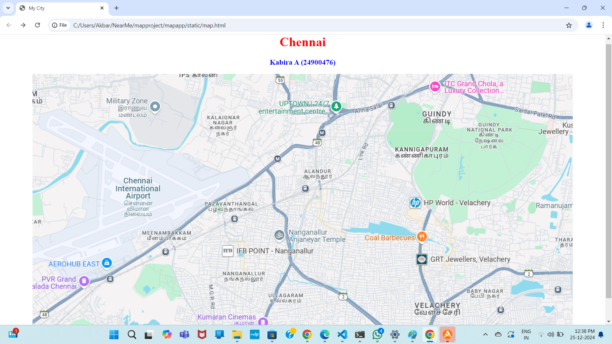
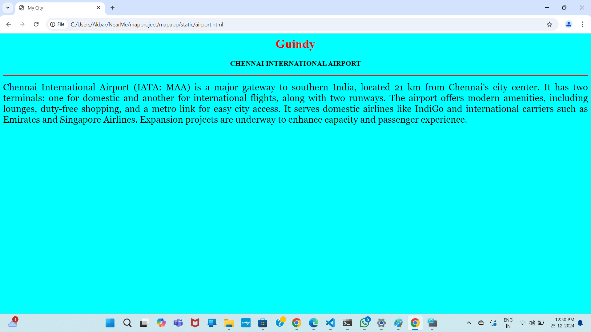
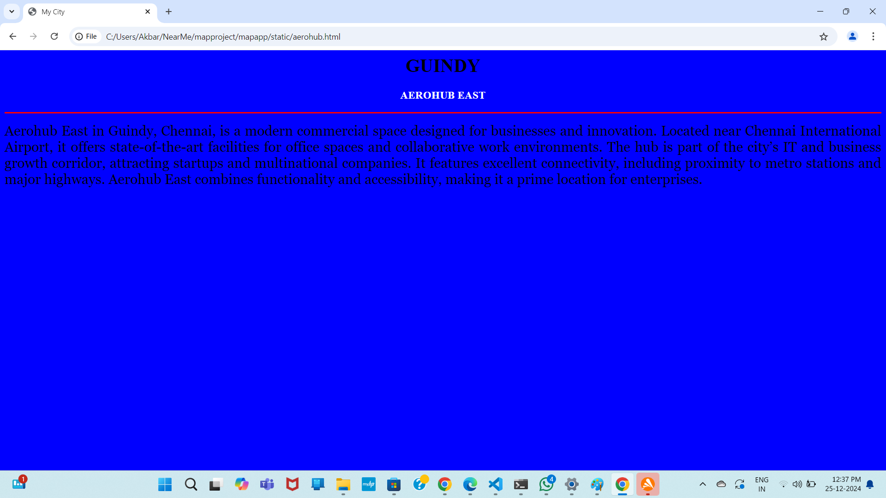
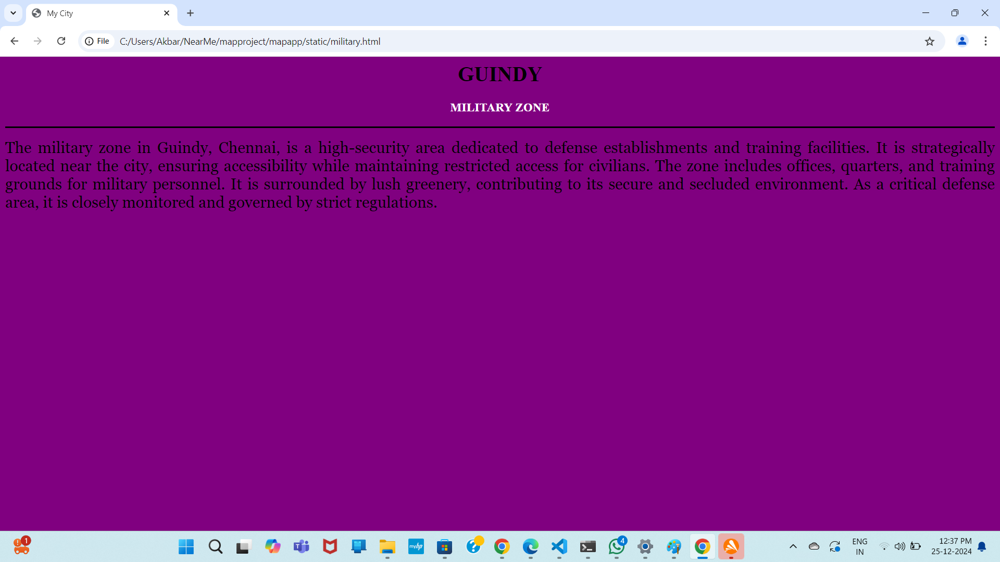
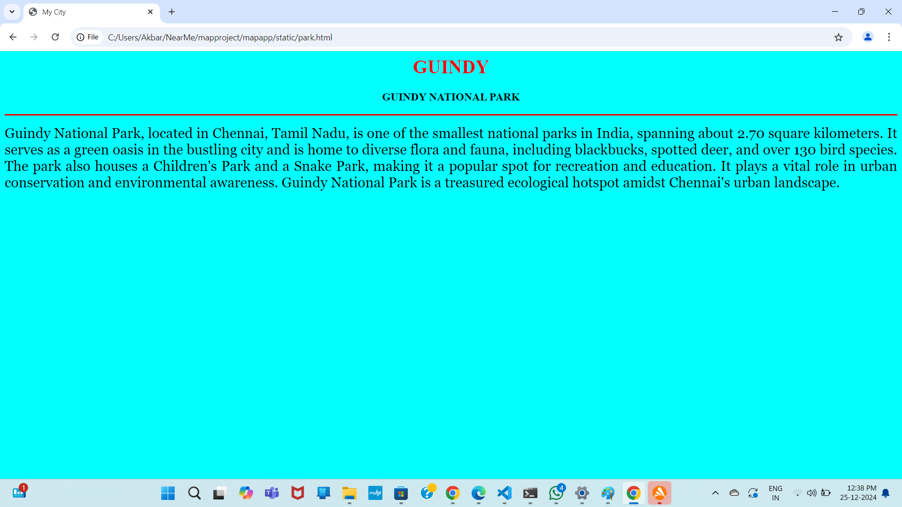
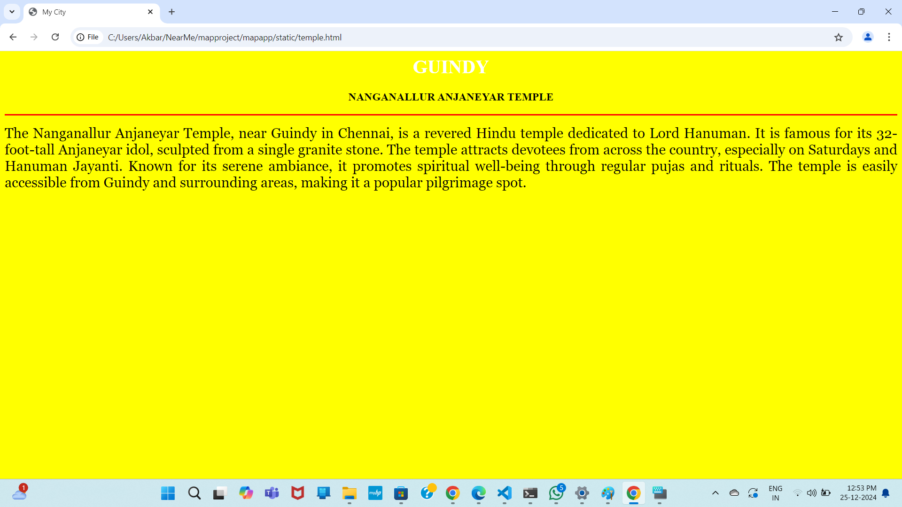

# Ex04 Places Around Me
## Date: 25.12.2024

## AIM
To develop a website to display details about the places around my house.

## DESIGN STEPS

### STEP 1
Create a Django admin interface.

### STEP 2
Download your city map from Google.

### STEP 3
Using ```<map>``` tag name the map.

### STEP 4
Create clickable regions in the image using ```<area>``` tag.

### STEP 5
Write HTML programs for all the regions identified.

### STEP 6
Execute the programs and publish them.

## CODE
```

map.html


<html>
<head>
<title> My City</title>
</head>
<body>
<h1 align="center">
<font color="red"><b>Chennai</b></font>
</h1>
<h3 align="center">
<font color="blue"><b> Kabira A (24900476)</b></font>
</h3>
<center>
   


<map name="MyCity">
    <area  title="Chennai International Airport" href="airport.html" coords="200,248,329,362" shape="rect">
    <area  title="Aerohub East" href="aerohub.html" coords="27,459,215,497" shape="rect">
    <area  title="Nanganallur Anjaneyar Temple" href="temple.html" coords="599,381,800,437" shape="rect">
    <area  title="Military Zone" href="military.html" coords="182,47,325,119" shape="rect">
    <area  title="Guindy National Park" href="park.html" coords="1086,114,1206,194" shape="rect">
</map>


</center>
</body>
</html>

airport.html


<html>
<head>
<title> My City</title>
</head>
<body bgcolor="cyan">
<h1 align="center">
<font color="red"><b>Guindy</b></font>
</h1>
<h3 align="center">
<font color="black"><b>CHENNAI INTERNATIONAL AIRPORT</b></font>
</h3>
<hr size="3" color="red">
<p align="justify">
<font face="Georgia" size="5">
    Chennai International Airport (IATA: MAA) is a major gateway to southern India, located 21 km from Chennai's city center. It has 
    two terminals: one for domestic and another for international flights, along with two runways. The airport offers modern amenities,
    including lounges, duty-free shopping, and a metro link for easy city access. It serves domestic airlines like IndiGo and 
    international carriers such as Emirates and Singapore Airlines. Expansion projects are underway to enhance capacity and passenger
    experience.
</font>
</p>
</body>
</html>

aerohub.html

<html>
<head>
<title> My City</title>
</head>
<body bgcolor="blue">
<h1 align="center">
<font color="black"><b>GUINDY</b></font>
</h1>
<h3 align="center">
<font color="white"><b>AEROHUB EAST</b></font>
</h3>
<hr size="3" color="red">
<p align="justify">
<font face="Georgia" size="5">
    Aerohub East in Guindy, Chennai, is a modern commercial space designed for businesses and innovation. Located near Chennai 
    International Airport, it offers state-of-the-art facilities for office spaces and collaborative work environments. The hub is part
    of the city’s IT and business growth corridor, attracting startups and multinational companies. It features excellent connectivity,
    including proximity to metro stations and major highways. Aerohub East combines functionality and accessibility, making it a prime
    location for enterprises.
</font>
</p>
</body>
</html>


military html

<html>
<head>
<title> My City</title>
</head>
<body bgcolor="purple">
<h1 align="center">
<font color="black"><b>GUINDY</b></font>
</h1>
<h3 align="center">
<font color="white"><b>MILITARY ZONE</b></font>
</h3>
<hr size="3" color="black">
<p align="justify">
<font face="Georgia" size="5">
    The military zone in Guindy, Chennai, is a high-security area dedicated to defense establishments and training facilities. It is
    strategically located near the city, ensuring accessibility while maintaining restricted access for civilians. The zone includes 
    offices, quarters, and training grounds for military personnel. It is surrounded by lush greenery, contributing to its secure and 
    secluded environment. As a critical defense area, it is closely monitored and governed by strict regulations.

</font>
</p>
</body>
</html>


park.html


<html>
<head>
<title> My City</title>
</head>
<body bgcolor="cyan">
<h1 align="center">
<font color="red"><b>GUINDY</b></font>
</h1>
<h3 align="center">
<font color="black"><b>GUINDY NATIONAL PARK</b></font>
</h3>
<hr size="3" color="red">
<p align="justify">
<font face="Georgia" size="5">
    Guindy National Park, located in Chennai, Tamil Nadu, is one of the smallest national parks in India, 
    spanning about 2.70 square kilometers. It serves as a green oasis in the bustling city and is home to diverse flora and fauna,
    including blackbucks, spotted deer, and over 130 bird species. The park also houses a Children's Park and a Snake Park, 
    making it a popular spot for recreation and education. It plays a vital role in urban conservation and environmental awareness.
    Guindy National Park is a treasured ecological hotspot amidst Chennai's urban landscape.
</font>
</p>
</body>
</html>


temple.html


<html>
<head>
<title> My City</title>
</head>
<body bgcolor="yellow">
<h1 align="center">
<font color="white"><b>GUINDY</b></font>
</h1>
<h3 align="center">
<font color="yellow"><b>NANGANALLUR ANJANEYAR TEMPLE</b></font>
</h3>
<hr size="3" color="red">
<p align="justify">
<font face="Georgia" size="5">
    The Nanganallur Anjaneyar Temple, near Guindy in Chennai, is a revered Hindu temple dedicated to Lord Hanuman. It is famous for its
    32-foot-tall Anjaneyar idol, sculpted from a single granite stone. The temple attracts devotees from across the country, especially
    on Saturdays and Hanuman Jayanti. Known for its serene ambiance, it promotes spiritual well-being through regular pujas and 
    rituals. The temple is easily accessible from Guindy and surrounding areas, making it a popular pilgrimage spot.
    
</font>
</p>
</body>
</html>

```

## OUTPUT







## RESULT
The program for implementing image maps using HTML is executed successfully.
